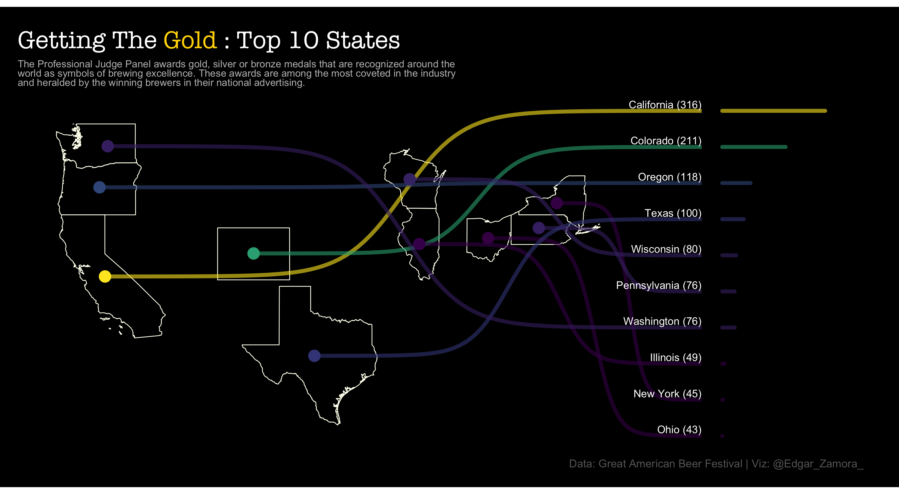

# Great American Beer Fesitval :beer::trophy:

For this weeks TidyTuesday, I explore data from the [Great American Beer
Festival](https://www.greatamericanbeerfestival.com/the-competition/winners/).
The Great American Beer Festival is a professionally judged competition
that awards gold, silver or bronze medals that are recognized around the
world as symbols of brewing excellence.

This week I explore the
[{sf}](https://r-spatial.github.io/sf/index.html) package by Edzer
Pebesma and the [{ggbump}](https://github.com/davidsjoberg/ggbump)
package by David Sjoberg. The {sf}, simple feature, package is a package
that helps computer understand the *spatial* geometry of objects in the
real world. There is much more detail that can be given regarding this
package and its underpinnings but that would be a bit much to talk
about. Also I do not quite understand it all but if you are interested I
would encourage you to check out the [documentation
page](https://r-spatial.github.io/sf/articles/sf1.html). The {ggbump} is
a package that extends ggplot2 functions and allows you to create bump
charts. You may wonder what is a bump chart? Well according to the
internet 😅, a bump chart is a graphic that is “used to compare two
dimensions against each other using one of the measure values”\[1\] with
it most often being used to visualize rankings. *With those two packages
in mind, I utilize features from both packages to make a graphic that
shows the top 10 gold medals by state*

1.  Bump chart :
    <https://www.tutorialspoint.com/tableau/tableau_bump_chart.htm>
