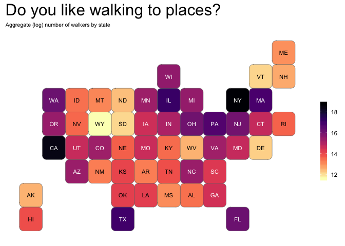

For this TidyTuesday I keep it easy and try my mapping skills using the
[`statebins`](https://github.com/hrbrmstr/statebins) by hrbrmstr.

Walkers by state
================

To prepare

``` r
#Compute total number of walkers per state
total_walking_num <- commute_mode %>% 
  filter(mode == "Walk" & !is.na(state_abb)) %>% 
  group_by(state_abb) %>% 
  summarize(walking_num = sum(n))
```

Creating a map
==============

``` r
ggplot(total_walking_num, aes(state = state_abb, fill = log2(walking_num))) +
  geom_statebins(border_col="grey40", border_size = .2) +
  scale_fill_viridis(option = "magma", direction = -1, label = comma,
                     name = "") +
  labs(title = "Do you like walking to places?",
       subtitle = "Aggregate (log) number of walkers by state") +
  theme(panel.background = element_blank(),
        plot.subtitle = element_text(size = 8),
        legend.position = "right",
        axis.ticks = element_blank(), 
        axis.text = element_blank(),
        plot.title = element_text(size = 23.5)) +
  guides(fill = guide_colourbar(barwidth = 0.7, barheight = 8))
```


