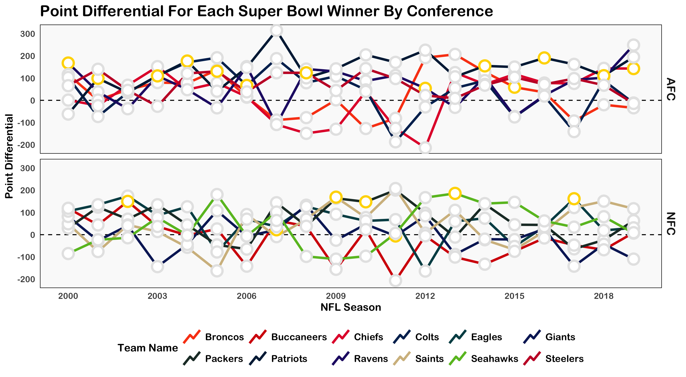

```{r setup, echo=FALSE, include=FALSE}
library(knitr)
```

# Super Bowl Winners 🏆🏈

For [Week 6](https://github.com/rfordatascience/tidytuesday/blob/master/data/2020/2020-02-04/readme.md) of #TidyTuesday we plot the point differential for each Super Bowl winner by Conference.


```{r image, echo=FALSE}

```
