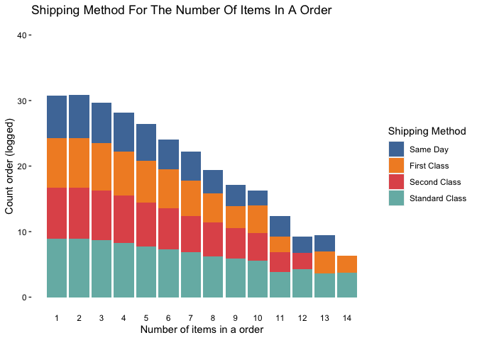
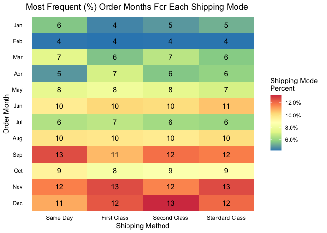
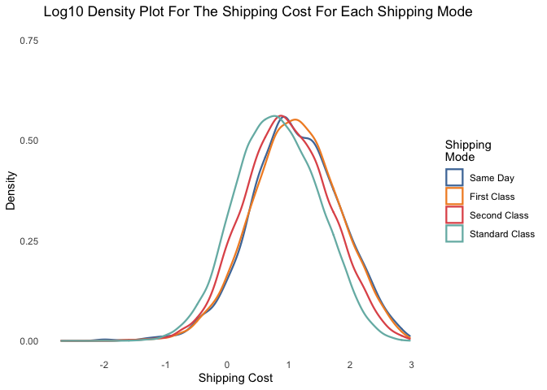

Predicting A Products Shipping Mode :package: w/ {tidymodels}
=============================================================

Having seen recent articles and tweets regarding the {tidymodels}
package, I decided to give it a try myself. Today I decide to use the
superstore dataset that is commonly used when working in Tableau. The
superstore data records purchases from fictional customers regarding
various products.

As is customary, we start by loading the necessary packages and data.

``` r
library(tidyverse)
library(tidymodels)
library(janitor)
library(readxl)
library(lubridate)
library(ggthemes)
library(viridis)

orders <- read_excel("data/Global Superstore.xls", sheet = "Orders") %>% 
  clean_names()

month_lu <- month.abb %>% 
  tibble(.name_repair = ~c("month_abb")) %>% 
  mutate(month = seq(1,12,1),
         month_abb = factor(month_abb, levels = c("Jan", "Feb", "Mar", "Apr",
                                                  "May", "Jun", "Jul", "Aug",
                                                  "Sep", "Oct", "Nov", "Dec")))

#data source: https://community.tableau.com/s/question/0D54T00000C5vSDSAZ/global-superstore-data-file


knitr::opts_chunk$set(fig.align = 'center')
```

For this post, we use the Superstore dataset from Tableau. The dataset
was found on the Tableau community forum and can found
[here](https://community.tableau.com/s/question/0D54T00000C5vSDSAZ/global-superstore-data-file).

Superstore Data
===============

The superstore dataset consist of transactions (fictional) for customers
order, including single and bulk orders. In addition to each individual
item, there are other transactional details like order and ship date,
shipping mode, profit margin and many other items. Below you can see the
complete list that is available

    ##  [1] "row_id"         "order_id"       "order_date"     "ship_date"     
    ##  [5] "ship_mode"      "customer_id"    "customer_name"  "segment"       
    ##  [9] "city"           "state"          "country"        "postal_code"   
    ## [13] "market"         "region"         "product_id"     "category"      
    ## [17] "sub_category"   "product_name"   "sales"          "quantity"      
    ## [21] "discount"       "profit"         "shipping_cost"  "order_priority"

The *main objective* of this post is to **predict a products shipping
mode** based on a set of predictors.

Though all factors may be relevant in helping to predict the shipping
mode of a customer, I decide to limit it to a few that I believe matter.
Note that this decision is not based on any scientific analysis or reach
but but instead is my perspective. The variables I decide to go with are
*order date*, *shipping data*, *segment*, *shipping cost*, *order
priority*, and *profit*.

``` r
head(orders) %>% 
  select(customer_id, order_date, ship_mode, segment,
         shipping_cost, order_priority, profit)
```

    ## # A tibble: 6 x 7
    ##   customer_id order_date          ship_mode segment shipping_cost order_priority
    ##   <chr>       <dttm>              <chr>     <chr>           <dbl> <chr>         
    ## 1 RH-19495    2012-07-31 00:00:00 Same Day  Consum…          934. Critical      
    ## 2 JR-16210    2013-02-05 00:00:00 Second C… Corpor…          924. Critical      
    ## 3 CR-12730    2013-10-17 00:00:00 First Cl… Consum…          915. Medium        
    ## 4 KM-16375    2013-01-28 00:00:00 First Cl… Home O…          910. Medium        
    ## 5 RH-9495     2013-11-05 00:00:00 Same Day  Consum…          903. Critical      
    ## 6 JM-15655    2013-06-28 00:00:00 Second C… Corpor…          897. Critical      
    ## # … with 1 more variable: profit <dbl>

Data Preparation
================

Prior to delving into some exploratory analysis, there are some
preproceesing steps that we need to take care as to avoid errors when
building our models.

The *first* part of our preproceesing is to create some new variables.
Using some `group_by()` on customer id and order date, we are able to
count how many items were sent within a particular order. This may
matter because a product that is being shipping with many other products
may receive a faster shipping mode. The other variable we create is one
that tells us in what month a product was shipped in. Using the
`month()` function from the {lubridate} package we are able to extract
the month.

The *second* part in our preprocessing is to convert some of the
character variables into numerical values. We apply this to the segment,
shipping mode, and order priority variable. Later on we will be using
the {recipes} package to further process these variables into a form
that our models will comport with.

``` r
processed_orders <- orders %>% 
  select(customer_id, order_date, ship_mode, segment,
         shipping_cost, order_priority, profit) %>% 
  group_by(customer_id, order_date) %>% 
  mutate(num_in_order = n()) %>% 
  ungroup() %>% 
  mutate(order_month = month(order_date),
         segment = case_when(segment == "Consumer" ~ 1,
                             segment == "Corporate" ~ 2,
                             TRUE ~ 3), #Home Office
         ship_mode = case_when(ship_mode == "Same Day" ~ 1,
                               ship_mode == "First Class" ~ 2,
                               ship_mode == "Second Class" ~ 3,
                               TRUE ~ 4), # Standard Class
         order_priority = case_when(order_priority == "Critical" ~ 1,
                                    order_priority == "High" ~ 2,
                                    order_priority == "Medium" ~ 3,
                                    TRUE ~ 4)) %>% #Low
  left_join(month_lu, by = c("order_month" = "month")) %>% 
  mutate_at(vars(ship_mode, segment, order_priority, order_month), ~as.factor(.)) %>% 
  select(-c(customer_id, order_date))
```

Exploratory Analysis
====================

Now that we have processed our data, we can begin exploring some of our
predictors to see what kind of relationship they have with a products
shipping mode.

Number Of Items In A Order
--------------------------

Below we consider the relationship between the number of items in a
order and the preferred method.

``` r
processed_orders %>% 
  count(num_in_order, ship_mode) %>% 
  ggplot(aes(num_in_order, log(n), fill = ship_mode)) +
  geom_col() +
  scale_fill_tableau(name = "Shipping Method",
                     labels = c("Same Day", "First Class", 
                                "Second Class", "Standard Class")) +
  scale_y_continuous(limits = c(0, 40)) +
  scale_x_continuous(breaks = seq(1,14, 1)) +
  labs(
    x = "Number of items in a order",
    y = "Count order (logged)",
    title = "Shipping Method For The Number Of Items In A Order"
  ) +
  theme(
    panel.grid = element_blank(),
    panel.background = element_blank(),
    axis.ticks.x = element_blank(),
    axis.text = element_text(colour = "black")
  )
```



With there being a large positive skew, logging the count of orders also
for a potential relationship to be observed. Not associated with our
relationship of interest, but we see that there are many orders that
content ten or less items per order. As for the number of items in an
order pertains to shipping method, we see that “same day” shipping is
less preferred as more items added to an order. The trend can be
somewhat seen with “second class” and “standard class” shipping. As for
the “first class” shipping, we see a ebb and flow in terms of their
overall composition of total orders.

Shipping Month
--------------

Exploring the distribution of shipping months for each shipping method
is important to explore because of the possibility of seasonality. In
the graphic below we can see that the frequency of when products are
shipped usually occurs in the later months of the year, specifically
during the festive months regardless of shipping method.

``` r
processed_orders %>% 
  count(ship_mode, month_abb) %>% 
  group_by(ship_mode) %>% 
  mutate(ship_mode_percent = n/sum(n)) %>% 
  ungroup() %>% 
  ggplot(aes(ship_mode, fct_rev(month_abb), fill = ship_mode_percent)) +
  geom_tile() +
  geom_text(aes(label = round(ship_mode_percent * 100, 0))) +
  scale_fill_distiller(palette = "Spectral",
                       labels = percent,
                       name = "Shipping Mode \nPercent") +
  scale_x_discrete(labels = c("Same Day", "First Class", 
                              "Second Class", "Standard Class"),) +
  labs(
    x = "Shipping Method",
    y = "Order Month",
    title = "Most Frequent (%) Order Months For Each Shipping Mode"
  ) +
  theme(
    axis.ticks = element_blank(),
    axis.text = element_text(color = "black"),
    panel.grid = element_blank(),
    panel.background = element_blank()
  )
```



Going forward, we may have to consider how to account for seasonal
difference in our model. One approach we could take is creating a dummy
variable that designates a December shipment versus a non December
shipment. Another approach is to split the year into quarters. Finally
the third approach we could take is creating groups of equal size as to
control for seasonality.

Shipping Cost
-------------

The last piece of data we will explore concerns the shipping cost for
each of the different shipping methods. To best visualize this
relationship, I decide to go with a density plot that will better
display the probability distribution. With the distribution of the
shipping cost being positively skewed, we need to account for it by
logging by base 10 all the values. For example if the shipping cost were
10, than the new logged valued would be 1 (1).

``` r
processed_orders %>% 
  mutate(shipping_cost = log10(shipping_cost)) %>% 
  ggplot(aes(shipping_cost, colour = ship_mode)) +
  geom_density(size = 0.8) +
  scale_colour_tableau(name = "Shipping \nMode",
                       labels = c("Same Day", "First Class", 
                                  "Second Class", "Standard Class")) +
  scale_y_continuous(limits = c(0, .75),
                     breaks = seq(0, .75, .25)) +
  labs(
    title = "Log10 Density Plot For The Shipping Cost For Each Shipping Mode",
    x = "Shipping Cost",
    y = "Density"
  ) +
  theme(
    axis.ticks = element_blank(),
    panel.grid = element_blank(),
    panel.background = element_blank(),
    legend.key = element_blank()
  )
```



Considering the shipping cost, we can see that generally the shipping
cost distribution for the different shipping modes are the same. For
those reasons it would seem as if shipping cost may not play as in
important role in helping use predict the shipping mode of an item.

Having explored some of the predictors, we are ready to start building
our model.

Creating A Recipe
=================

The {recipes} package offers a easy and reproducible way to preprocess
data to be able to fit a new model. I will not go into full detail about
what all the {recipes} package can do but for more information visit the
{recipes} [page](https://recipes.tidymodels.org/index.html).

It has been my experience that models are particular in the way that
variables are structured, for that reason the {recipes} package is great
at formatting predictors in a the right structure. In the following code
I start by removing the month abbreviations because they do not make

``` r
model_data <- processed_orders %>% 
  select(-month_abb)

model_recipe <- recipe(ship_mode ~ ., data = model_data) %>% 
  step_normalize(c(shipping_cost, profit))
```

Building models
===============

``` r
model_split <- initial_split(model_data)
model_training <- training(model_split)
model_testing <- testing(model_split)
```

Reporting Results
=================

Conclusions
===========
