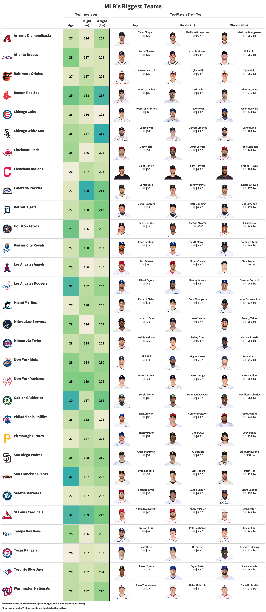

<figure>
  
  <figcaption><a href="https://www.wbur.org/onlyagame/2017/06/23/backyard-baseball-computer-game-history">Martin Kessler</a></figcaption>
</figure>

```{r setup, include=FALSE}
# Load packages
library(tidyverse)
library(janitor)
library(gt)
library(scales)
library(knitr)
library(htmltools)
library(webshot)
library(here)

knitr::opts_chunk$set(echo = TRUE)
```

As the 2021 MLB season was winding down and the New York Yankees were fighting for a Wild Card spot, I frequently heard the commentators refer to how tall the Yankees were. Aaron Judge (6'7"), Giancarlo Stanton (6'6"), and Luke Voit (6'3") are among the taller Yankee players, which got me thinking how tall the Yankees as a team is compared to other MLB teams. Using physical characteristics from ESPN MLB rosters, I compare the average height, age, and weight among MLB teams. 

# Loading Data

The data is gathered using ESPN roster profiles and the `{mlbstatsR}` package. The script for the data can be found in the [script folder](https://github.com/Edgar-Zamora/My-Work/blob/master/Tidyverse/RStudio%20Table%20Contest/2021/script/get_mlb_player_char.R) in this GitHub repository.

```{r load_data}
mlb_player_char <- read_rds(here("Tidyverse", "RStudio Table Contest", "2021", "data", "mlb_player_char.rds"))
```

# Calculating Averages

Part of the `{gt}` table includes team averages for age, weight, and height along with the highest for each metric within a team. The code below collects those metrics and prepares them for the table.

```{r calc_metrics}
# Max players for each team
## Weight
max_weight <- mlb_player_char %>% 
  group_by(team_name)  %>% 
  filter(wt_lbs == max(wt_lbs)) %>% 
  slice(1) %>% 
  ungroup() %>% 
  select(team_name, name, x, pos, wt_lbs, player_number) %>% 
  mutate(max_weight = paste0("<div style='display: flex; align-items:center;'><div><span>",
                             name,
                             "</span><br><span><center><span style='color:#B4B4B4'>", 
                             pos, "</span>",
                             " | ", wt_lbs, 
                             " lbs </center></span</div></div>"))


## Height
max_ht <- mlb_player_char %>% 
  group_by(team_name) %>% 
  filter(ht_cm == max(ht_cm)) %>% 
  slice(1) %>% 
  ungroup() %>% 
  mutate(max_ht = paste0("<div style='display: flex; align-items:center;'><div><span>",
                         name,
                         "</span><br><span><center><span style='color:#B4B4B4'>", 
                         pos, "</span>",
                         " | ",ht, 
                         "</center></span</div></div>")) %>% 
  select(team_name, max_ht)


## Max Age
max_age <- mlb_player_char %>%
  group_by(team_name) %>% 
  filter(age == max(age)) %>% 
  slice(1) %>% 
  ungroup() %>% 
  mutate(max_age =  paste0("<div style='display: flex; align-items:center;'><div><span>",
                           name,
                           "</span><br><span><center><span style='color:#B4B4B4'>", 
                           pos, "</span>",
                           " | ", age, 
                           "</center></span</div></div>")) %>% 
  select(team_name, max_age)


# Team Averages
mlb_data <- mlb_player_char %>% 
  mutate(team_name_gt = paste0("<div style='display: flex; align-items:center;'><div><span>&nbsp;&nbsp;",
                               team_name,
                               "</span><br><span></span</div></div>")) %>% 
  group_by(team_name, team_name_gt) %>% 
  summarise(
    avg_age = mean(age),
    avg_ht = mean(ht_cm),
    avg_weight = mean(wt_lbs)
  ) %>% 
  left_join(max_age, by = "team_name") %>% 
  left_join(max_ht, by = 'team_name') %>% 
  left_join(max_weight, by = "team_name") %>% 
  ungroup() %>% 
  select(team_name_gt, starts_with("avg"), max_age, max_ht, max_weight)
  


```

# Creating `{gt}` table

Using the amazing `{gt}` package, I use many different features to show the difference in height, age, and weight across MLB teams.

Highlights:
* Embedding html in some columns
* Using Google Fonts 
* Conditional formatting

```{r gt_tbl, eval=FALSE}
# Tablizing
gt_tbl <- mlb_data %>% 
  gt() %>% 
  fmt_markdown(
    columns = c(team_name_gt, starts_with("max"))
  ) %>% 
  fmt_number(
    columns = c(starts_with("avg")),
    decimals = 0
  ) %>% 
  
  # Formatting Columns
  cols_label(
    team_name_gt = ' ',
    avg_age = "Age",
    avg_ht = "Height (cm)",
    avg_weight = "Weight (lbs)",
    max_age = "Age",
    max_ht = "Height (ft)",
    max_weight = "Weight (lbs)",
  ) %>% 
  cols_align(
    columns = c(starts_with("avg"), starts_with("max")),
    align = "center"
  ) %>% 
  cols_width(
    team_name_gt ~ px(300),
    starts_with("avg") ~ px(75),
    starts_with("max") ~ px(250)
  ) %>% 
  tab_header(
    title = "MLB's Biggest Teams"
  ) %>% 
  tab_spanner(
    label = "Team Averages",
    columns = c(starts_with("avg"))
  ) %>% 
  tab_spanner(
    label = "Top Players From Team",
    columns = c(starts_with("max"))
  ) %>% 
  
  # Styling specific cells
  tab_style(
    style = list(
      cell_borders(
        sides = "left",
        color = "black",
        weight = px(6)
      )
    ),
    locations = list(
      cells_body(
        columns = c(max_age)
      )
    )
  ) %>% 
  tab_style(
    style = list(
      cell_text(size = px(22))
    ),
    locations = cells_body(
      columns = c(team_name_gt)
    )
  ) %>% 
  tab_style(
    style = list(
      cell_text(size = px(18))
    ),
    locations = cells_body(
      columns = starts_with("avg")
    )
  ) %>% 
  
  # Footnotes
  tab_footnote(
    footnote = "When there was a tie I considered age and height. This is my decision and arbitrary.",
    locations = cells_column_spanners(
      spanners = "Top Players From Team"
    )
  ) %>% 
  tab_footnote(
    footnote = md("Using *cm* instead of *ft* allows one to see the distribution better."),
    locations = cells_column_labels(
      columns = avg_ht
    )
  ) %>% 
  
  # Coloring team averages with darker being a higher value
  data_color(
    columns = starts_with("avg"),
    colors = col_numeric(
      palette = c("#F2EDDC", "#DCE5BA", "#AED898", "#77CA7F", "#35AEAB"),
      domain = NULL
    )
  ) %>% 
  
  # General table options
  tab_options(
    table.border.top.color = "white",
    table.border.bottom.color = "white"
  ) %>% 
  tab_style(
    style = cell_text(
      size = px(16),
      font = c(
        google_font(name = "Mochiy Pop P One")
      )
    ),
    locations = cells_body(
      columns = c(team_name_gt)
    )
  ) %>% 
  tab_style(
    style = cell_text(
      size = px(14),
      font = c(
        google_font(name = "Mochiy Pop P One")
      )
    ),
    locations = cells_body(
      columns = c(avg_age:avg_weight)
    )
  ) %>% 
  tab_style(
    style = cell_text(
      size = px(13),
      font = c(
        google_font(name = "Mochiy Pop P One")
      )
    ),
    locations = cells_body(
      columns = c(max_age:max_weight)
    )
  ) %>% 
  tab_style(
    style = cell_text(
      size = px(14),
      font = c(
        google_font(name = "Mochiy Pop P One")
      )
    ),
    locations = list(
      cells_column_labels(columns = everything()),
      cells_column_spanners(spanners = everything())
    )
  ) %>% 
  tab_style(
    style = cell_text(
      size = px(30),
      font = c(
        google_font(name = "Mochiy Pop P One")
      )
    ),
    locations = cells_title(
      groups = "title"
    )
  )

gtsave(gt_tbl, "MLBs Biggest Teams.png", vwidth = 2000)

```


