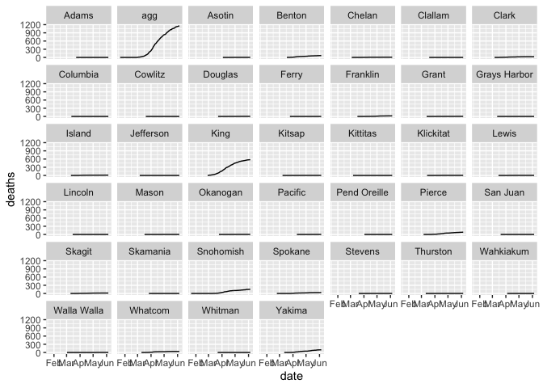

``` r
#Loading packages
library(tidyverse)
```

    ## ── Attaching packages ───────────────────────────────────────────────────────── tidyverse 1.3.0 ──

    ## ✓ ggplot2 3.3.0     ✓ purrr   0.3.4
    ## ✓ tibble  3.0.1     ✓ dplyr   0.8.5
    ## ✓ tidyr   1.0.0     ✓ stringr 1.4.0
    ## ✓ readr   1.3.1     ✓ forcats 0.4.0

    ## Warning: package 'tibble' was built under R version 3.6.2

    ## Warning: package 'purrr' was built under R version 3.6.2

    ## ── Conflicts ──────────────────────────────────────────────────────────── tidyverse_conflicts() ──
    ## x dplyr::filter() masks stats::filter()
    ## x dplyr::lag()    masks stats::lag()

``` r
library(viridis)
```

    ## Loading required package: viridisLite

``` r
#Load data
df <- read_csv("us-counties.csv") %>% 
  filter(state == "Washington",
         county != "Unknown") %>% 
  select(-c(fips, state))
```

    ## Parsed with column specification:
    ## cols(
    ##   date = col_date(format = ""),
    ##   county = col_character(),
    ##   state = col_character(),
    ##   fips = col_character(),
    ##   cases = col_double(),
    ##   deaths = col_double()
    ## )

``` r
df %>% 
  group_by(date) %>% 
  summarise(cases = sum(cases),
            deaths = sum(deaths)) %>%
  mutate(county = "agg") %>% 
  bind_rows(df) %>% 
  ggplot(aes(date, deaths, group = county)) +
  geom_line() +
  facet_wrap(~county)
```


